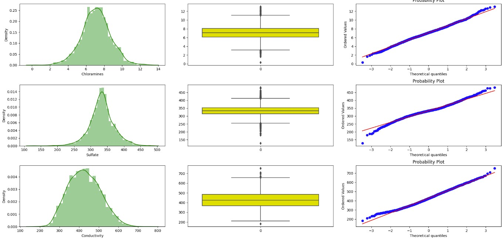

# Proses Machine Learning Secara End To End


disc :
- upload file pada github dilakukan scr manual karena samapi saat ini masi terkendala pada saat push github.
- pengembangan maschine learning dilakukan end to end damun secara lokal, untuk pengembangan secara online masih terkendala.

## Pengembangan Model Machine Learning menggunakan Pada Notebook

### Data understanding dan preparation
Kualitas air adalah suatu ukuran kondisi air dilihat dari karakteristik fisik, kimiawi, dan biologisnya. Kualitas air juga menunjukkan ukuran kondisi air relatif terhadap kebutuhan biota air dan manusia. Kualitas air sering kali menjadi ukuran standar terhadap kondisi kesehatan ekosistem air dan kesehatan manusia terhadap air minum.
kali ini kita akan melakukan prediksi mengenai kelayakan air minum menggunakan machine learning, dan diperoleh data sbb :


sc : kaggle

1. ph : adalah derajat keasaman yang digunakan untuk menyatakan tingkat keasaman atau kebasaan yang dimiliki oleh suatu larutan.
2. Hardness : istilah yang merujuk pada senyawa kandungan yang terlarut pada air itu sendiri, seperti magnesium dan ion kalsium sedangkan kandungan mineral air dipengaruhi dari bebatuan, sungai dan wilayah lain di mana air itu mengalir.
3. solids : atau Total Dissolved Solid (TDS) merupakan istilah untuk menandakan jumlah padatan terlarut atau konsentrasi jumlah ion kation (bermuatan positif) dan anion (bermuatan negatif) di dalam air
4. Chloramines : Bahan kimia chloramine terbentuk dari nitrogen--ditemukan dalam air seni manusia dan keringat--dengan klorin dalam kolam renang
5. Sulfate : Sulfat dan air bereaksi membentuk asam sulfat yang terbentuk melalui oksidasi. Sulfat berbahaya bagi kesehatan apabila telah melewati batas kadar maksimum.
6. Conductivity :  mengukur kemampuan air untuk melewatkan aliran listrik. Kemampuan ini langsung berhubungan ke konsentrasi ion di air.
7. Organic Carbon : Total Organic Carbon (TOC) merupakan ukuran tidak langsung dari molekul organik yang diukur sebagai karbon.
8. Trihalometahens : Trihalometan adalah senyawa yang terdiri dari empat bahan kimia, yaitu Kloroform, Bromodiklorometan, Dibromokolometan, dan Bromofrom. Senyawa ini terbentuk bersama dengan disinfeksi air yang dihasilkan dari klorin, apabila dikonsumsi dalam jumlah banyak dapat menyebabkan kanker kolon.
10. Turbidity : Kekeruhan dapat diartikan sebagai ukuran relatif kejernihan air. Kekeruhan bukanlah ukuran langsung dari partikel tersuspensi dalam air tetapi sebaliknya, yaitu ukuran efek hamburan partikel-partikel tersebut terhadap cahaya.

Setelah mengerti mengenai variabel data langkah selanjutnya dalam data analisis adalah :

### Cek Missing Data


impute data

```
imputer = KNNImputer(n_neighbors=10, weights="uniform")
l=imputer.fit_transform(dataset)
waterpot=pd.DataFrame(l,columns=dataset.columns)
```

### Splitting Data
```
x_train, x_test, y_train, y_test = train_test_split(x, y, test_size = 0.2, random_state = 42, stratify = y)
x_valid, x_test, y_valid, y_test = train_test_split(x_test, y_test, test_size = 0.5, random_state = 42, stratify = y_test)
```

Lalu dump data ke dalam pickle
```
utils.pickle_dump(dataset, config["dataset_cleaned_path"])
utils.pickle_dump(x_train, config["train_set_path"][0])
utils.pickle_dump(y_train, config["train_set_path"][1])
utils.pickle_dump(x_valid, config["valid_set_path"][0])
utils.pickle_dump(y_valid, config["valid_set_path"][1])
utils.pickle_dump(x_test, config["test_set_path"][0])
utils.pickle_dump(y_test, config["test_set_path"][1])
```
### Eksporatory Data Analysis

1. Lakukan ringkasan statistik pada data train


2. Lakukan pengecekan terhadap imbalance data


3. Lakukan visualisasi Grafik dan Plot





4. Lakukan perhitungan Korelasi antar variable 


5. Lakukan Pengujian Statistik
\

### Data Preprocessing

Langkah yang perlu dilakukan pada preprocessing berdasarkan EDA adalah.
1. Oversample Data
```
x_ros, y_ros = SMOTE(random_state = 42).fit_resample(
    train_set.drop(columns = config["label"]),
    train_set[config["label"]]
)
train_set_bal = pd.concat([x_ros, y_ros], axis = 1)
```


